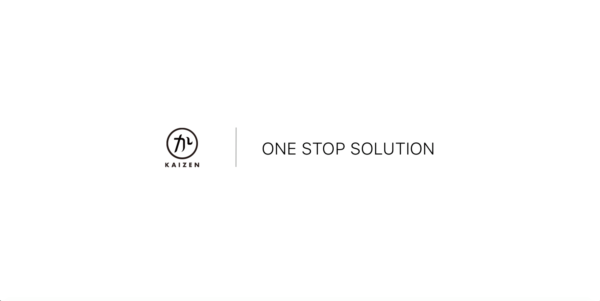
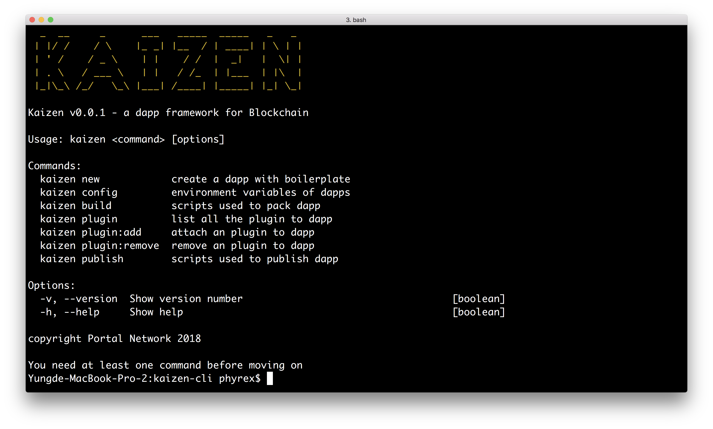

<p align=center>

</p>


<p align=center>
<h1 align=center>KAIZEN CLI</h1>
</p>

<a target="_blank" href="https://circleci.com/gh/PhyrexTsai/kaizen-cli" title="CircleCI"></a>
<a target="_blank" href="https://github.com/PortalNetwork/nifty-game/pulls" title="PRs Welcome"></a>
<a href="#"></a>
<a target="_blank" href="#"></a>

> KAIZEN 是為 dapp 和 dweb 開發人員所研發的一站式解決方案

| [English](./README.md) | [한국어](./README_KR.md) | [中文](./README_ZH.md) |

## 📚 手冊
有關 KAIZEN 的更多詳細信息，請訪問 [DOCS](https://kaizen-cli.readthedocs.io/)

## 🚀 概要
KAIZEN 是為 dapp 和 dweb 開發人員研發的一站式解決方案。 KAIZEN包括:
- 內建的智能合約匯集，鏈接，部署和管理
- 使用 Mocha 和 Chai 進行自動程式測試
- 可以透過技術支援來組態化自訂的構建過程

#### 安裝
```
npm install -g kaizen-cli 
```

## 🔨 命令集

- `kaizen new` - 從遠端git存儲庫創建一個dapp模板
- `kaizen config` - dapp的環境變數
- `kaizen plugin:add` - 將插件加至dapp
    - [Bluzelle](https://www.npmjs.com/package/bluzelle)
    - [NOIA](https://www.npmjs.com/package/@noia-network/sdk-react)
    - [NKN](https://www.npmjs.com/package/nkn-client)
- `kaizen plugin:remove` - 將插件從dapp移除
- `kaizen build` - 用於打包dapp的腳本
- `kaizen publish` - 用於發布dapp的腳本

## 🏗 使用



#### 創建 dapp 項目

```
kaizen new -n <name> -b <vue|react>
```

## 📣 參與貢獻
若想參與貢獻，請參考 [CONTRIBUTING.md](./CONTRIBUTING.md)

## 🗒 執照
詳細內容請參考 [LICENSE](./LICENSE)
