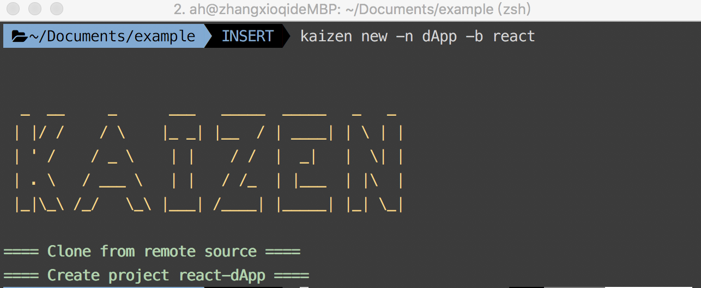
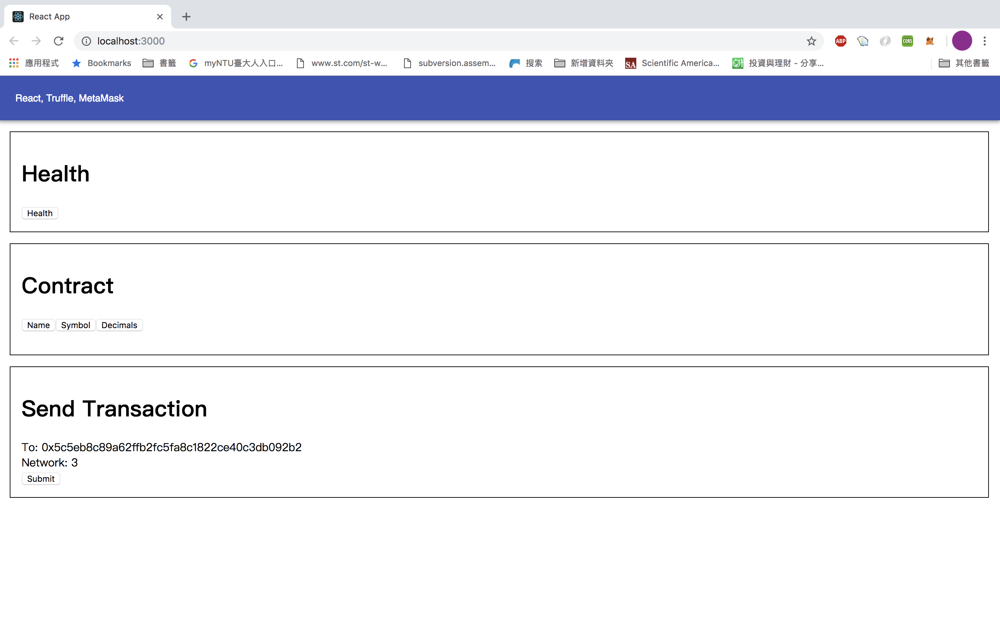

# Create your first dApp based on Kaizen-Cli

## What is dApp?
`dApp` is abbreviation of decentralized application. In short, it's a web application which is capable of interacting usually within Ethereum blockchain. It will call a smart contract essentially.

## Prerequisite

`Kaizen-cli` installed.

```
npm install -g kaizen-cli
```

## Let's start

1. Create a boilerplate through `kaizen-cli`.

```
kaizen new -n <name> -b <vue|react>
```
There are two arguments necessary to create a new project:
- `-n` : followed by the desired `name` of project.
- `-b` : choose your preferred front-end framework `vue|react`.

In the following example, we will create a dApp of React as front-end framework named `dApp`.
```
kaizen new -n dApp -b react
```


2. And you will see a new project be created. The directory layout is like:
```
dApp
├── DOCUMENT.md
├── LICENSE
├── README.md
├── SMART_CONTRACT.md
├── TRUFFLE.md
├── config
│   ├── ...
│
├── contracts
│   ├── BasicToken.sol
│   ├── ...
│   
├── kaizen.json
├── migrations
│   ├── 1_initial_migration.js
│   └── 2_deploy_contracts.js
├── package.json
├── public
│   ├── favicon.ico
│   ├── index.html
│   └── manifest.json
├── scripts
│   ├── build.js
│   ├── start.js
│   └── test.js
├── src
│   ├── actions
│   │   ├── ...
|	|
│   ├── apis
│   │   ├── ...
|	|
│   ├── components
│   │   ├── ...
|	|
│   ├── constants
│   │   ├── ...
|	|
│   ├── container
│   │   ├── ...
|	|
│   ├── index.css
│   ├── index.js
│   ├── lib
│   │   ├── ...
|	|
│   ├── reducers
│   │   ├── ...
|	|
│   ├── registerServiceWorker.js
│   ├── routes.js
│   ├── sagas
│   │   ├── ...
|	|
│   └── store
│       ├── ...
|	
├── test
│   ├── TestMetacoin.sol
│   ├── metacoin.js
│   └── simpleToken.js
└── truffle.js
```

- `kaizen.json` : configuration for publishing dApp 
- `contracts/` : storage directory of smart contracts
- `migrations` : script of smart contract deployment(for truffle)
    - `/1_initial_migration.js` : Used to deploy Migrations contract which stores the number of the last deployment script applied. The initial migration files rarely need to be changed.
    - `/2_deploy_contracts.js` :  Used to describe what contract would be deployed.
- `src/` : storage directory of front-end project.
- `test/` : directory of `jest ` test scripts.
- `truffle.js` : configurations of truffle like which network would be connected.

We will just use the default configuration of all files in the following example.

3. Change to `dApp/` and install all dependency module.

```
cd dApp && npm install && npm install -g ganache-cli truffle
```

[Here's](./TRUFFLE.md) a brief introduction of `truffle` and `ganache`.

4. Take a glance at `./migrations/2_deploy_contracts.js`:

```js
var ConvertLib = artifacts.require("./ConvertLib.sol");
var MetaCoin = artifacts.require("./MetaCoin.sol");
var SimpleToken = artifacts.require("./SimpleToken.sol");

module.exports = function(deployer) {
  deployer.deploy(ConvertLib);
  deployer.link(ConvertLib, MetaCoin);
  deployer.deploy(MetaCoin);
  deployer.deploy(SimpleToken);
};
```

It describes which contract will be deploy to the blockchain later, you can change to different contracts on your own.

5. Test on localnet first, open a new console and type:

```
ganache-cli
```
It will boot up the private chain on your `loacalhost:8545`, and it will print the information of the private chain.


6. Start to delpoy contracts.

```
truffle migrate
```


7. Now, we can interact with the delpoyed contract through front-end.
```
npm start
```

