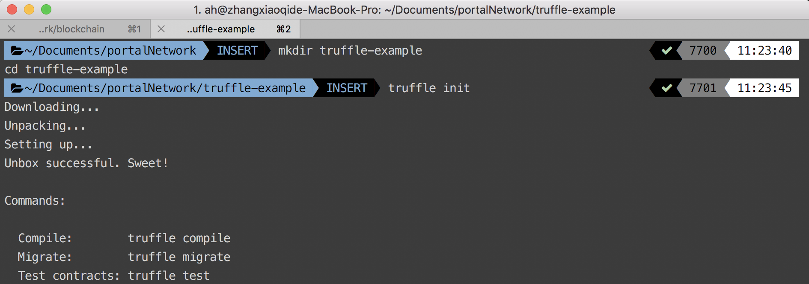
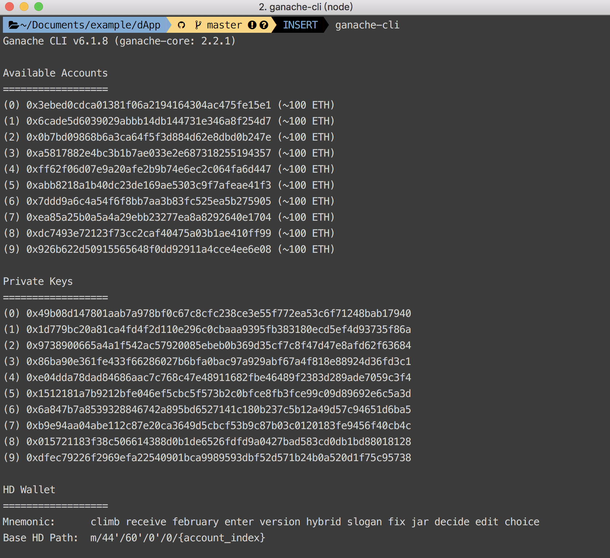
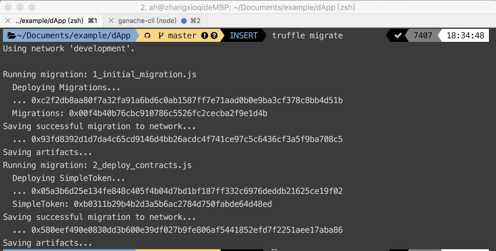

# Truffle suite

`Truffle` is a development environment, testing framework and asset pipeline for Ethereum, aiming to help you compile smart contract, test and deploy. You also need `ganache` to host a local private blockchain to test your contract.

## Installation

```
npm install -g truffle
npm install -g ganache-cli
```

## Quick start

We need to create a truffle project first to use truffle commands within it. Create a new project folder and initialize it with truffle.

```
mkdir truffle-example
cd truffle-example
truffle init
```


The directory layout:
```
truffle-example
├── contracts
│   └── Migrations.sol
├── migrations
│   └── 1_initial_migration.js
├── test
│   └── ...
└── truffle.js
```
- `contracts/` : Smart contracts storage.
- `migrations/` : Scripts of contracts deployment.
- `test/` : Test script storage.
- `truffle.js` : Truffle configuration file.

Let's take a look at `truffle.js`:

```js
module.exports = {
  // See <http://truffleframework.com/docs/advanced/configuration>
  // to customize your Truffle configuration!
};
```
There is nothing within it temporarily, let's add some code snippets to it.

```js
// Remeber to  install truffle-hdwallet-provider first.
// npm i -g truffle-hdwallet-provider
var HDWalletProvider = require("truffle-hdwallet-provider");

// Provide your wallet mnemonic
var mnemonic = "concert load couple harbor equip island argue ramp clarify fence smart topic";

module.exports = {
  networks: {
    development: {
      host: "localhost",
      port: 8545,
      network_id: "*" // Match any network id
    },
    ropsten: {
      provider: new HDWalletProvider(mnemonic, "https://ropsten.infura.io/"),
      network_id: 3 // official id of the ropsten network
    }
  }
};
```
We jsut set up the network which our smart contracts will be deployed to. As default, it will choose `development` network which is configured as `localhost:8545` which is the default port `ganache` running on.

Next, dive into `contracts` folder and create a file named `MetaCoin.sol` with the following code fragment:

``` js
pragma solidity ^0.4.4;

import "./ConvertLib.sol";

// This is just a simple example of a coin-like contract.
// It is not standards compatible and cannot be expected to talk to other
// coin/token contracts. If you want to create a standards-compliant
// token, see: https://github.com/ConsenSys/Tokens. Cheers!

contract MetaCoin {
	mapping (address => uint) balances;

	event Transfer(address indexed _from, address indexed _to, uint256 _value);

	function MetaCoin() {
		balances[tx.origin] = 10000;
	}

	function sendCoin(address receiver, uint amount) returns(bool sufficient) {
		if (balances[msg.sender] < amount) return false;
		balances[msg.sender] -= amount;
		balances[receiver] += amount;
		Transfer(msg.sender, receiver, amount);
		return true;
	}

	function getBalanceInEth(address addr) returns(uint){
		return ConvertLib.convert(getBalance(addr),2);
	}

	function getBalance(address addr) returns(uint) {
		return balances[addr];
	}
}

```
It's our first smart contract which allows you create your own token on the blockchain. It includes of the other one contract files, add it to `contracts/` as well.

`ConvertLib.sol`
```js
pragma solidity ^0.4.4;

library ConvertLib{
	function convert(uint amount,uint conversionRate) returns (uint convertedAmount)
	{
		return amount * conversionRate;
	}
}
```

The last thing before we start to deploy contract, we must tell truffle what contracts needed to be deployed. Change to `migrations/` folder and create a new file named `2_deploy_contracts.js`

```js
var ConvertLib = artifacts.require("./ConvertLib.sol");
var MetaCoin = artifacts.require("./MetaCoin.sol");

module.exports = function(deployer) {
  deployer.deploy(ConvertLib);
  deployer.link(ConvertLib, MetaCoin);
  deployer.deploy(MetaCoin);
};
```

Now we can deploy contracts to our `localhost`, we need to boot it up through `gangache`. Open a new terminal and type in:
```
ganache-cli
```


Start to delpoy contracts:

```
truffle migrate
```


You can see the deployed contract address.

## Reference
[ganache-cli](https://github.com/trufflesuite/ganache-cli)
[truffle](https://github.com/trufflesuite/truffle)